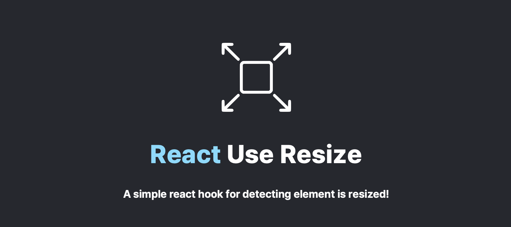

# react-use-resize



## Getting started

```bash
npm i react-use-resize
# or
yarn add react-use-resize
```

## Examples

```tsx
import useResize from 'react-use-resize';

function App() {
  const { elementRef } = useResize<HTMLHeadingElement>(() => {
    // ... onResize logic
  });

  return (
    <div>
      <h1 ref={elementRef}>Hello World</h1>
    </div>
  );
}
```

### With checking element is overflowed

```tsx
import useResize from 'react-use-resize';

function App() {
  const { elementRef, isWidthOverflowed, isHeightOverflowed } = useResize<HTMLHeadingElement>(
    () => {
      // ... onResize logic
    },
    {
      // Set enableOverflow to true!
      enableOverflow: true,
    },
  );

  return (
    <div>
      <h1 ref={elementRef}>Hello World</h1>
    </div>
  );
}
```

## API Guides

### Parameters

```typescript
/**
 * Callback function when element is resize.
 */
export type OnResize = ResizeObserverCallback;

/**
 * Options for useResize hook
 */
export type Options = {
  /**
   * Options Resize Observer API  BOx options
   */
  box?: ResizeObserverBoxOptions;
  /**
   * Option for elements is overflowed.
   */
  enableOverflow?: boolean;
  /**
   * Delay for onResize callback function
   */
  debounceDelay?: number;
};

export type ElementSizeOverflow = {
  /**
   * Boolean for checking width is overflowed
   */
  width: boolean;
  /**
   * Boolean for checking height is overflowed
   */
  height: boolean;
};
```

### Returns

```tsx
type Returns<T extends Element> = {
  /**
   * Element is observed by ResizeObserver instance
   */
  elementRef: React.RefObject<T>;.

  /**
   * The value is for checking width of element is overflowed
   */
  isWidthOverflowed: boolean;

  /**
   * The value is for checking height of element is overflowed
   */
  isHeightOverflowed: boolean;
};
```

## License

MIT
